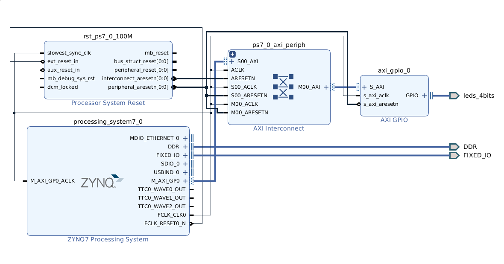

# GPIO Led Proof-Of-Concept

This Repository is a proof of concept for controlling LEDs of the Zybo Board. It
contains:
* A Vivado Project for the FPGA implementation in the directory `vivado-2018.2/led`
* A Python Script for Linux **gpio-led.py** in the directory `xillinux`
* A C++ Implementation for Genode in directory `genode-led`

The FPGA translates memory mapped input/outputs to switch on/off leds.

In order to test this core, two applications are written.

## Linux

The first one is implemented in Python and use the provided physical memory
addresses via `/dev/mem` of Linux in order to control the LEDs. [Installation](docs/xillinux.md)

## Genode

The second implementation targets Genode. It consists of a driver component and
a test application. Both components communicate via IPC. [Installation](docs/genode.md)

## Result

The four LEDs `L00`, `L01`, `L02` and `L03` should alternately blink.
[Video](gpio-led-video.mp4)

## Debugging

In [docs/debug.md](docs/debug.md), a short introduction to ILA (Integrated Logic
Analyzer) is given.
