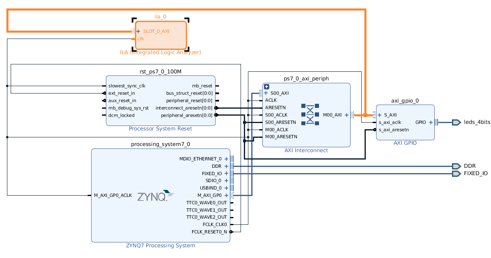
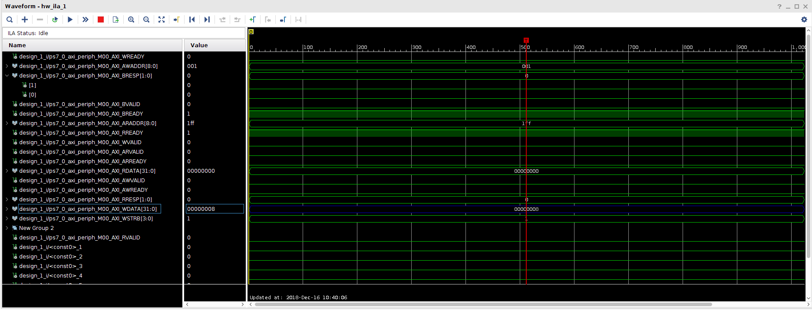

# Debugging AXI\_GPIO

In the beginning, the Genode Driver for the AXI_GPIO LEDs didn't
work. Everything compiled and run, but the LED did not blink. It was not clear,
if the MMIO mapped addresses of Genode and the AXI\_GPIO are the same.

A good starting point is adding the ILA (Integrated Logic Analyzer) and
connecting it to the AXI GPIO Bus (marked orange in the picture).

The modified vivado project `led` is named `led_debug` and located in
`vivado-2018.2`, too.

Now, it is possible to connect to the device in Vivado and see all signals.

The column marked with color blue is the data register, which represents the
actual LEDs. One bit for every LED. Right know, the register is set to `0x8`,
which means that all four LEDs are enabled.

# ILA in Genode
Due to unknown reasons, it is not possible to connect to the ILA core, when
Genode is already booted. Following trick works:
1. Boot into U-Boot
2. Flash FPGA
3. Connect Vivado to Device. Now the signal tab should appear.
4. Boot Genode
